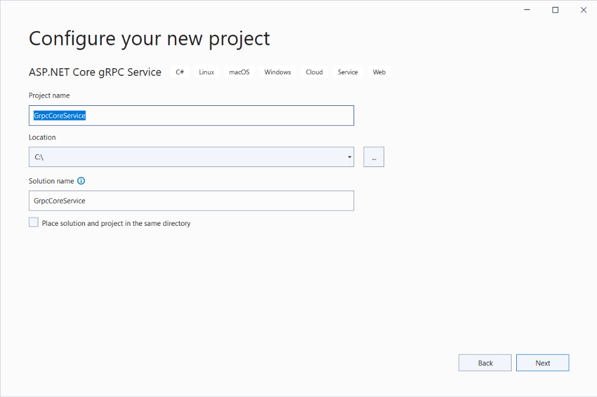
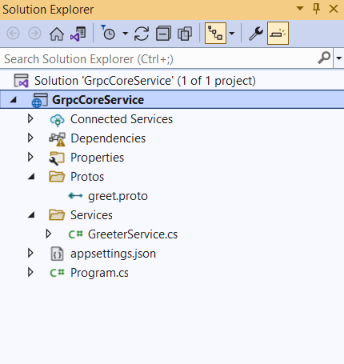

# .NET6.0 - gRPC Service and Client implementation #

### Introduction

- gRPC (Google Remote Procedure Calls) is a modern open-source high-performance Remote Procedure Call (RPC) framework that can run in any environment.
- It can efficiently connect services in and across data centers with pluggable support for load balancing, tracing, health checking, and authentication. 
- It is also applicable in the last mile of distributed computing to connect devices, mobile applications, and browsers to backend services.
- Read more details about [gRPC here](https://grpc.io/about/)

### Solution and Project setup:
#### Set Up gRPC Service:
- Open Visual Studio 2022 and create a new gRPC project, and name it to **GrpcCoreService** and select **.NET 6.0** under the Framework option.
	
	
	

- Review the project structure.<br />
	
	
- Right-click on **greet.proto** and click on Properties and verify that gRPC Stub Classes is set to Server only.
	

#### Set Up Client Application:
- Add a Console App Project with the name **GrpcClientApp** and select the required configuration.
	
	
	

- Add the required packages to the client app project.
	```
	Install-Package Grpc.Net.Client
	Install-Package Google.Protobuf
	Install-Package Grpc.Tools
	```

- Create a **Protos** folder and copy the **Protos\greet.proto** file from the **GrpcCoreService** under this folder.
- Update the namespace inside the greet.proto file to the project's namespace:
	```
	option csharp_namespace = "GrpcClientApp";
	```
- After that right click on **greet.proto** and click on Properties and set the gRPC Stub Classes to Client only.
	

- Finally, edit the **GrpcClientApp.csproj** project file:
	```
	<ItemGroup>
	  <Protobuf Include="Protos\greet.proto" GrpcServices="Client" />
	</ItemGroup>
	```

- Once this is completed update the **Program.cs** file to call the greeter service.
	```
	var message = new HelloRequest
	{
	    Name = "Sandeep Kumar"
	};
	var channel = GrpcChannel.ForAddress("http://localhost:5181");
	var client = new Greeter.GreeterClient(channel);
	var serverResponse = await client.SayHelloAsync(message);

	Console.WriteLine(serverResponse.Message);
	Console.WriteLine("Press any key to exit...");
	Console.ReadKey();
	```

### Run and Test:

- **Set Up StartUp Project:** Configure both projects as startup projects in the proper order.
	
	
- Run the project and review the output of both the gRPC service and the client in the Console window.
	
	

### Setup employee service and Test:
- Add **employee.proto** file under the **Protos** folder.
- Under the **Services** folder add the **EmployeeService.cs**.
- Inject this new service under the **Program.cs**.
	```
	app.MapGrpcService<EmployeeService>();
	```
	
- Once service setup is completed setup the client app by implementing the **employee.proto** and then update the **Program.cs**.
	```
	var channel = GrpcChannel.ForAddress("http://localhost:5181");
	var client = new Employee.EmployeeClient(channel);

	Console.WriteLine("Enter Employee ID....");
	var inputStr = Console.ReadLine();

	int empId = 0;
	if (!int.TryParse(inputStr, out empId))
	{
	    Console.WriteLine("This is invalid Employee ID, please exit and try again....");
	}
	else
	{
	    var emp = new GetEmpDetail { EmpId = empId };

	    var serverResponse = await client.GetEmpInformationAsync(emp);
	    Console.WriteLine("Employee Name | Role | Email ID | Department");
	    Console.WriteLine($"{serverResponse.EmpName} | {serverResponse.EmpRole} | {serverResponse.EmpEmail} | {serverResponse.EmpDepartment}");
	}
	Console.WriteLine("Press any key to exit...");
	Console.ReadKey();
	```
	
- Review the project structure after adding all the required files.<br />
	
	
- Run the project and review the output in the Console window.
	
	
