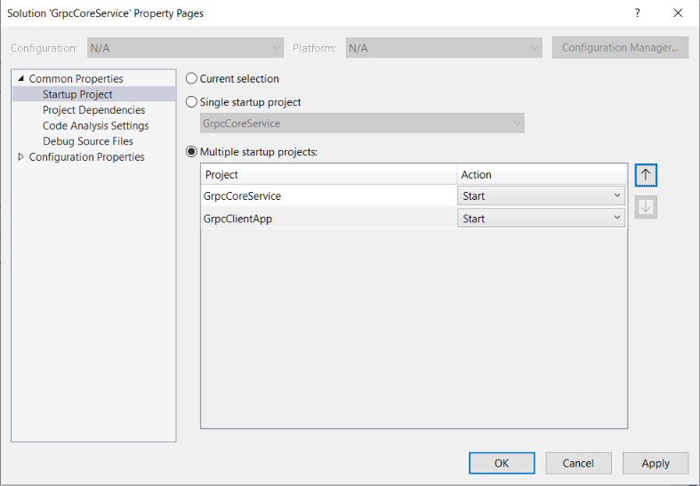
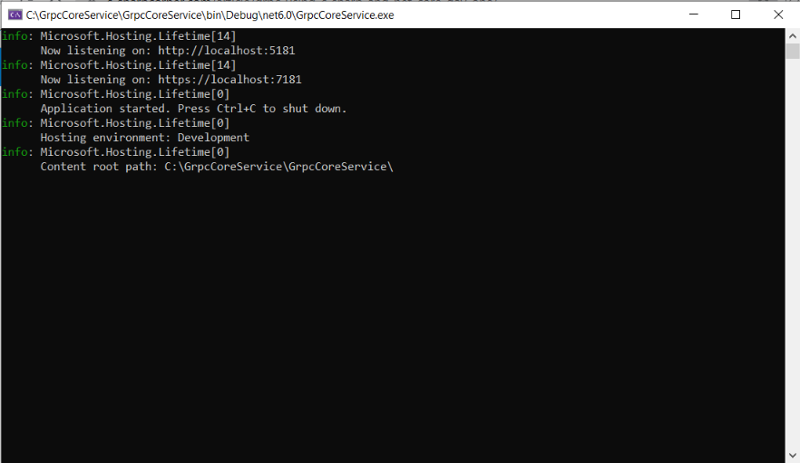
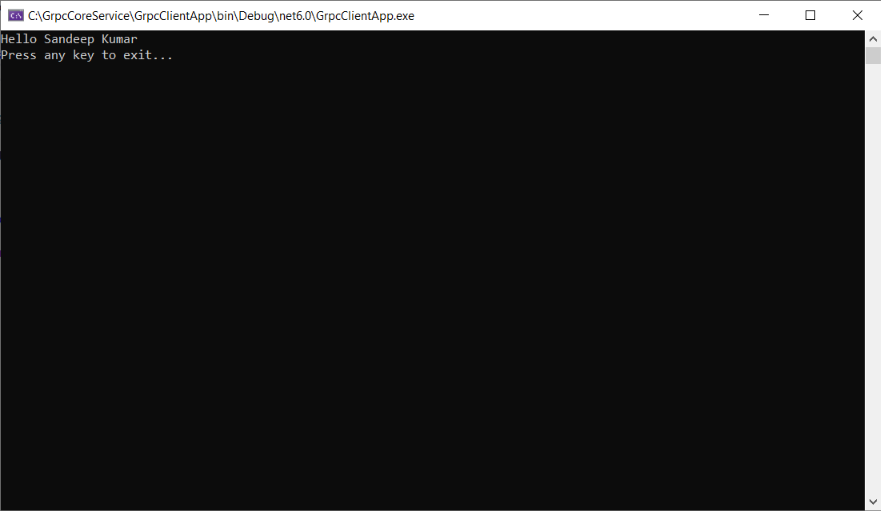
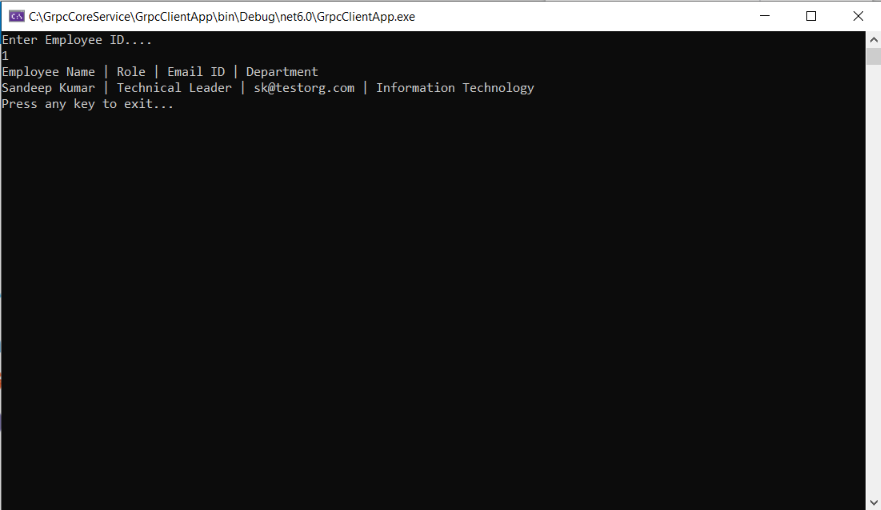

# .NET6.0 - gRPC Service and Client implementation #

### Introduction ###

- gRPC (Google Remote Procedure Calls) is a modern open-source high-performance Remote Procedure Call (RPC) framework that can run in any environment.
- It can efficiently connect services in and across data centers with pluggable support for load balancing, tracing, health checking, and authentication. 
- It is also applicable in the last mile of distributed computing to connect devices, mobile applications, and browsers to backend services.
- Read more details about [gRPC here](https://grpc.io/about/)

### Solution and Project setup: ###
- **Set Up gRPC Service:** Open Visual Studio 2022 and create a new gRPC project, and name it to **GrpcCoreService** and select **.NET 6.0** under the Framework option.
	
	
	

	- Review the project structure.
	
	
	- Right click on **greet.proto** and click on Properties and verify that gRPC Stub Classes is set to Server only.
	

- **Set Up Client Application:** Add a Console App Project with the name **GrpcClientApp** and select the required configuration.
	
	
	
	
	- Review the project structure.
	

	- Add the required packages in the client app project.
	```
	Install-Package Grpc.Net.Client
	Install-Package Google.Protobuf
	Install-Package Grpc.Tools
	```

	- Create a Protos folder and copy the **Protos\greet.proto** file from the **GrpcCoreService** under this folder.
	- Update the namespace inside the greet.proto file to the project's namespace:
	>     option csharp_namespace = "GrpcClientApp";
	- After that right click on **greet.proto** and click on Properties and set the gRPC Stub Classes to Client only.
	

	- Finally, edit the **GrpcClientApp.csproj** project file:
	```
	<ItemGroup>
	  <Protobuf Include="Protos\greet.proto" GrpcServices="Client" />
	</ItemGroup>
	```

	- Once this is completed update the Program.cs file to call the greeter service.

- **Set Up StartUp Project** Configure both projects as startup projects in proper order.
	
	
- **Run and Test:** Run the project and review the output of both the gRPC service and client in the Console window.
	
	

	- Add the reference to projects (**Application**, **Core**, and **Sql**), and also add a new folder **Repository**.

	- Add the required packages to be used in this project.
	>     Install-Package Dapper
	>     Install-Package Microsoft.Extensions.Configuration
	>     Install-Package Microsoft.Extensions.DependencyInjection.Abstractions
	>     Install-Package System.Data.SqlClient

### Setup employee service and Test: ###
- Add a new employee service by adding **employee.proto** file and implement the **EmployeeService.cs**.
- Once service setup is completed setup the client app by implementing the **employee.proto** and then update the **Program.cs** to call the employee service and show the result.
	
	